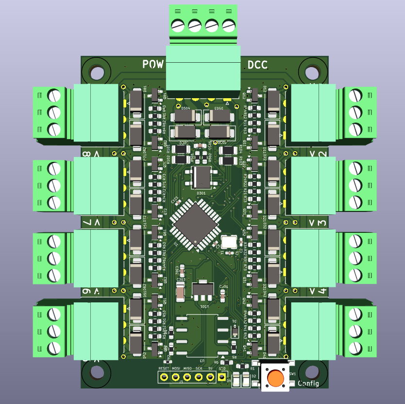
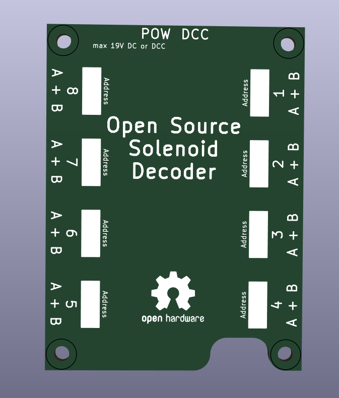

# OS-Solenoid-Decoder

This is the main decoder for solenoid accessories such as turnouts, relays, and decouplers. It supports multiple output modes and works seamlessly with various relay extensions.

## 📄 Manual

- [📘 Full User Manual (PDF)](docs/Manual.pdf)

## 🖼️ Hardware Preview

