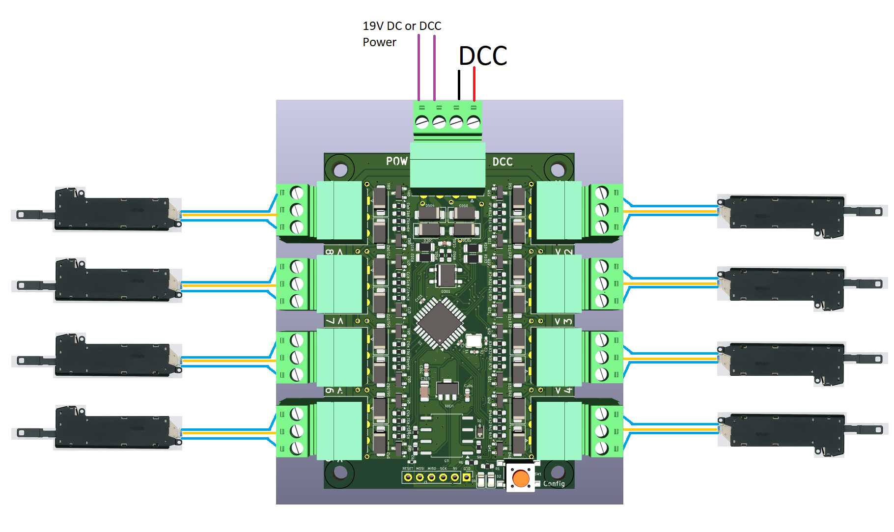
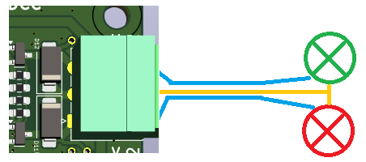
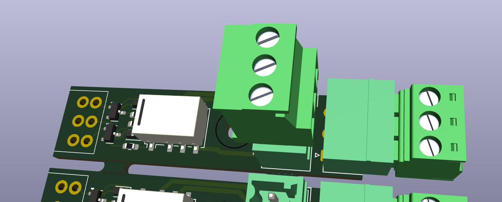
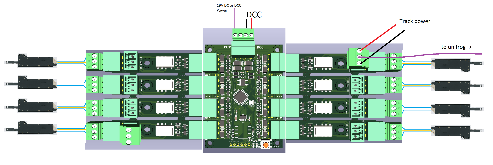
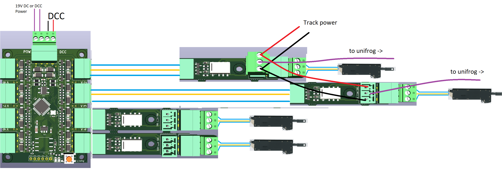
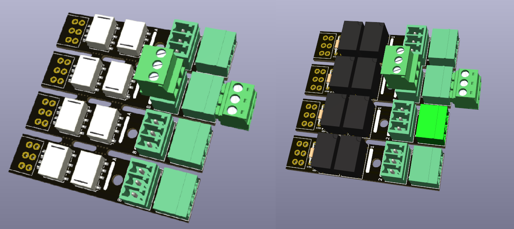
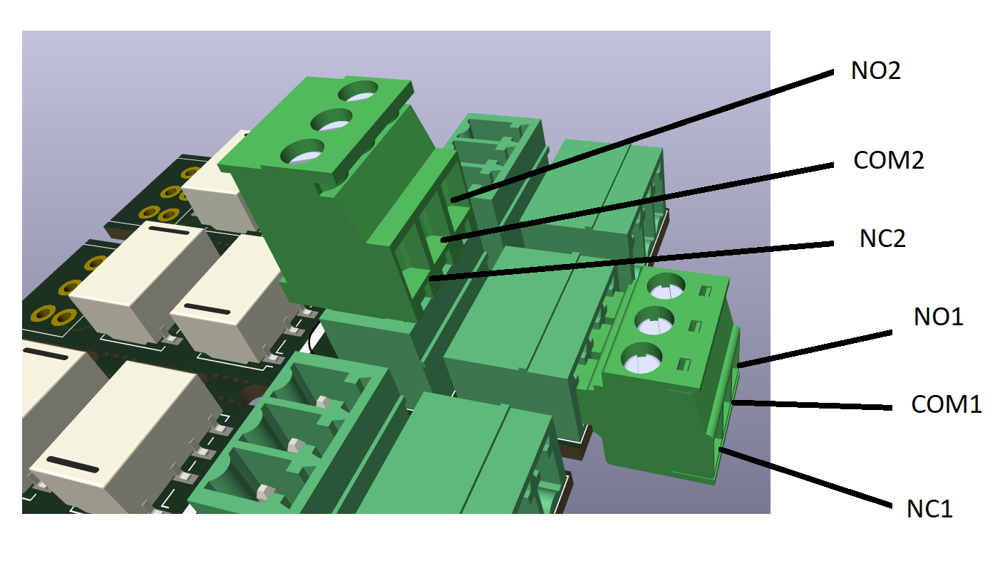
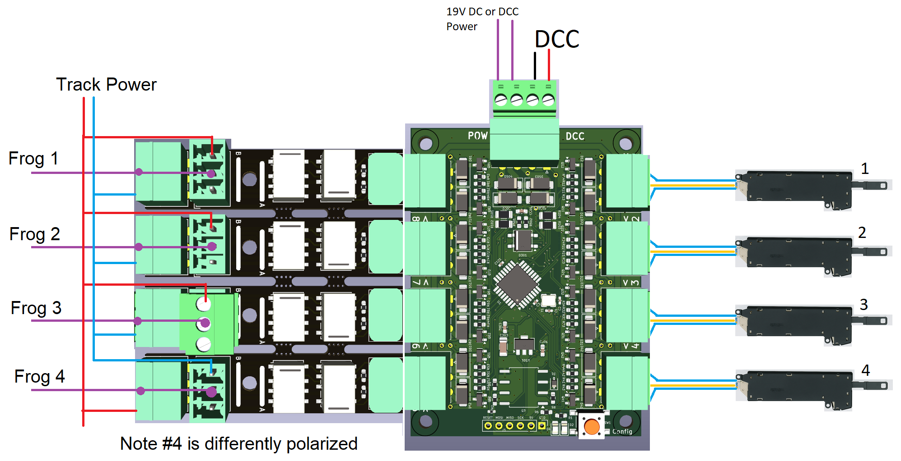
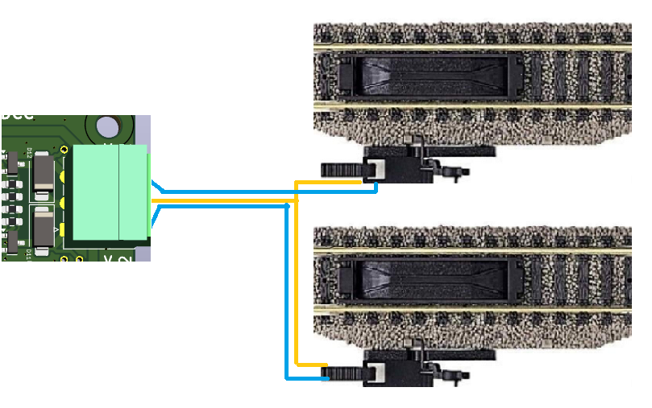
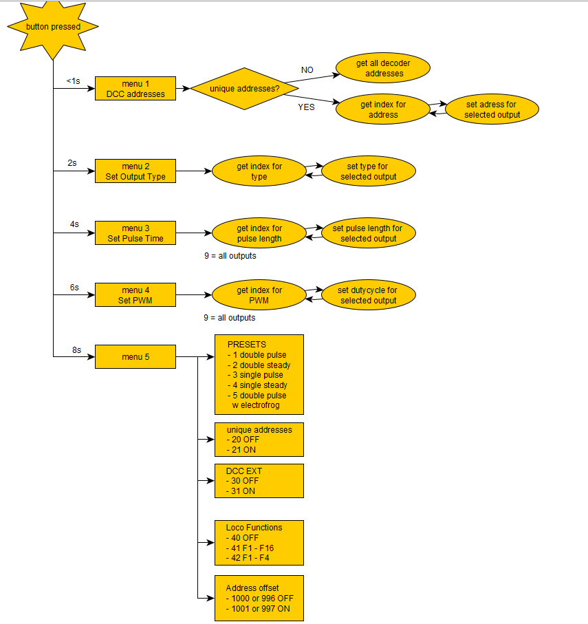

> 🌐 &nbsp; 🇬🇧 EN &nbsp;|&nbsp; [🇩🇪 DE](Manual-DE.md) &nbsp;|&nbsp; [🇫🇷 FR](Manual-FR.md) &nbsp;|&nbsp; [🇳🇱 NL](Manual-NL.md) &nbsp;|&nbsp; [🇪🇸 ES](Manual-ES.md) &nbsp;|&nbsp; [🇮🇹 IT](Manual-IT.md) &nbsp;|&nbsp; [🇵🇱 PL](Manual-PL.md) &nbsp;|&nbsp; [🇨🇿 CS](Manual-CS.md) &nbsp;|&nbsp; [🇩🇰 DA](Manual-DA.md) &nbsp;|&nbsp; [🇳🇴 NO](Manual-NO.md) &nbsp;|&nbsp; [🇸🇪 SV](Manual-SV.md) &nbsp;|&nbsp; [🇭🇺 HU](Manual-HU.md) &nbsp;|&nbsp; [🇵🇹 PT](Manual-PT.md)

# OS-Solenoid-Decoder

## 📘 Introduction

The OS-Solenoid-Decoder is a simple, powerful DCC accessory decoder for switching:

- Turnouts (point motors)
- Relays
- Uncouplers
- Any other solenoid-driven device

It can handle loads of up to 5 amps and supports almost any type of point motor.
It can also be used in combination with OS-relays to handle frog polarization for both electrofrog and unifrog turnouts.

This decoder is designed to be:

- **Easy to wire** — pluggable screw terminals make pre-wiring straightforward and allow quick removal or replacement
- **Easy to configure** — uses only standard DCC accessory commands; no computer, no CV, no POM
- **Modular** — optional relay and transistor expansion boards
- **Robust** — built-in overload protection

Whether you're building a large layout or just want something that works without hassle: this decoder is made to get the job done.

---

## Table of Contents

- [Features](#-features)
- [Connecting the Decoder](#-connecting-the-decoder)
- [Power Supply](#-power-supply)
- [Solenoid Outputs](#-solenoid-outputs)
- [Relay Extension – Unifrog Polarization](#-relay-extension--unifrog-polarization)
- [Relay Extension – Electrofrog Polarization](#-relay-extension--electrofrog-polarization)
- [Relay Extension – Open Contact (General Purpose)](#️-relay-extension--open-contact-general-purpose)
- [Decouplers and Other Inductive Loads](#-decouplers-and-other-inductive-loads)
- [Configuring the OS-Solenoid-Decoder](#️-configuring-the-os-solenoid-decoder)
- [LED Behavior in Operating Mode](#-led-behavior-in-operating-mode)
- [Entering Configuration Mode](#-entering-configuration-mode)
- [Before You Start](#-before-you-start)
- [Menu Overview](#-menu-overview)
- [Menu 1: DCC Address Assignment](#-menu-1-dcc-address-assignment)
- [Menu 2: Output Type Selection](#-menu-2-output-type-selection)
- [Menu 3: Pulse Time Configuration](#-menu-3-pulse-time-configuration)
- [Menu 4: PWM Duty Cycle](#-menu-4-pwm-duty-cycle)
- [Menu 5: Global Settings & Presets](#-menu-5-global-settings--presets)
- [Loco Function Control Explained](#-loco-function-control-explained)

---

## 🔧 Features

- **Up to 5 A total output current** — drives heavy-duty solenoids, relays or turnout motors without external boosters
- **Pluggable screw terminals** — makes pre-wiring easy and allows quick removal or replacement of the decoder
- **Multiple output modes:**
  - Double Pulse (default)
  - Single Pulse
  - Double Steady
  - Single Steady
  - Double Pulse with Electrofrog Relay
- **One output at a time** — the decoder switches one output pair at a time to prevent overload
- **Optional CDU module support** — reduces power consumption and extends turnout motor life
- **Overload detection and protection** — outputs are automatically disabled if an overload is detected
- **Configuration via DCC commands only** — no programming software or hardware required
- **Predefined configuration presets** — quickly switch all outputs to pulse, steady, or electrofrog mode with a single DCC command
- **Loco function control** (F1–F16) — for fast switching via throttles like the Roco Lokmaus or Multimaus
- **Roco address offset support** — built-in support for the Roco 4-address offset
- **Expandable with relay and transistor boards:**
  - Double relay module for electrofrog turnout polarization
  - Single latching relay for unifrog polarity switching
  - Open-contact relay modules for general-purpose DCC relay control
  - Transistor driver module for two-wire turnout motors

---

## 🔌 Connecting the Decoder

The OS-Solenoid-Decoder follows a clear and consistent wiring layout. Power is connected at the top, outputs are on both sides.

---

## 🔋 Power Supply

- Connect either DCC track voltage or a DC power supply (max. 19 V) to the decoder.
- Both the DCC signal and the power lines connect from the top side of the decoder.
- ⚠️ Do not use AC voltage — this will damage the decoder.

---

## ⚡ Solenoid Outputs

The decoder provides 8 dual output blocks, designed for classic twin-coil turnout motors.

Each output block has:

- Two outer screw terminals — for the left and right coil (A and B)
- One center terminal — for the common wire (COM), shared between the two coils

This layout lets you:

- Drive up to 8 twin-coil point motors (e.g. PECO, Fleischmann, Märklin, Roco, Piko, Hornby)
- Or connect 3-wire turnout motors like the MTB MP-1 directly

Outputs are grouped in pairs with clear A, COM, and B labeling.

Although the decoder is not designed for signal control, it can drive simple two-aspect signals using the same outputs.

---

## 🔌 Relay Extension – Unifrog Polarization

This extension automatically powers the frog of unifrog turnouts using self-latching relays.

- The relay board consists of four small relay units, which can be snapped apart if you need fewer than four.

- The relays are latched by the same signal used to trigger the turnout motor — no extra configuration is needed.
- Each relay unit switches the frog polarity based on the direction of the turnout.

With one relay per turnout, this extension handles up to 8 unifrog frogs using two boards.

- The relay board plugs directly into the decoder's expansion header, but can also be mounted remotely near the turnout.

This relay module is also compatible with other solenoid decoders.

---

## ⚡ Relay Extension – Electrofrog Polarization

Electrofrog turnouts require two relay switches per turnout:

1. One to disconnect the frog before switching the point motor
2. One to reconnect it with the correct polarity afterwards

This extension handles that sequence automatically. It consists of four dual-relay modules, permanently linked.

- It plugs into the left side of the decoder (marked for electrofrog use).
- Each relay pair is linked to one solenoid output: output 1 → relay pair 1, output 2 → relay pair 2, etc.
- These modules cannot be separated, as they share track power and internal logic.

The decoder has a special preset mode that activates the electrofrog switching sequence.
If frog polarity is wrong after installation, flip the jumpers on the relay module to correct it — no reprogramming needed.

---

## ⚙️ Relay Extension – Open Contact (General Purpose)

For switching external devices (lights, signals, logic circuits) using plain relay contacts:

- Each unit provides a double-throw (NO/NC) relay, controllable via DCC.
- Up to 16 individually addressable relay contacts when fully populated.
- The modules plug directly into the decoder or can be used remotely with wires.
- Available in a through-hole DIY version and a compact SMD version.

Like the unifrog relay boards, these modules can be snapped apart and reused with other DCC solenoid decoders.

The General Purpose relay extension can also polarize electrofrog turnouts with slightly more wiring:

- Use the NO (Normally Open) contacts
- Loop both COM contacts together and connect them to the frog
- Connect the NO contacts to the track power rails

If a frog ends up with the wrong polarity, swap the two track power lines (as shown for frog 4 in the diagram above).

---

## 🧲 Decouplers and Other Inductive Loads

The OS-Solenoid-Decoder can drive decouplers, electromagnets, and other inductive loads in addition to turnout motors.

- **Single Pulse mode** (recommended) — sends a short burst of current, ideal for spring-loaded or time-sensitive coils
- **Single Steady mode** — keeps the output continuously on, useful for monostable relays or simple ON/OFF devices

⚠️ Decouplers can overheat if switched for too long — always check the datasheet for your track brand and keep pulse times short.

---

## ⚙️ Configuring the OS-Solenoid-Decoder

By default the decoder operates in normal mode when powered. Two LEDs provide visual feedback about what's happening.

---

## 🔦 LED Behavior in Operating Mode

| LED Pattern | Mode |
|-------------|------|
| Both LEDs blinking | Double Pulse (default) |
| One LED blinking, one OFF | Single Pulse |
| Both LEDs ON | Double Steady |
| One LED ON | Single Steady |
| One LED ON + other LED blinking | Electrofrog Mode (double pulse + frog relay) |

When outputs are configured with mixed types, the left LED stays ON and the right LED blinks once continuously to indicate mixed-config mode.

---

## 🧰 Entering Configuration Mode

To enter configuration mode:

1. Hold the configuration button. The right LED starts blinking:
   - 1 blink = Menu 1
   - 2 blinks = Menu 2
   - ... up to Menu 5
2. Release the button when the LED reaches the menu you want.

Once in a menu:

- The left LED blinks the same number of times as the menu number (e.g. 3 blinks = Menu 3).
- Press the button again to exit the menu, unless the section below says otherwise.

---

## 🧠 Before You Start

If you plan to use mixed output types (e.g. Single Steady for relays alongside Double Pulse for point motors), plan your output assignments on paper first.

**Example:** if outputs 5–8 should be Single Steady (for 8 relays) and outputs 1–4 should be Double Steady (for point motors), you must:

1. Use Menu 2 to assign the correct output types
2. Then use Menu 1 to assign DCC addresses carefully, because Single outputs use more addresses

---

## 📖 Menu Overview

| Menu | Function |
|------|----------|
| 1 | DCC Address Assignment |
| 2 | Output Type Selection |
| 3 | Pulse Time Configuration |
| 4 | PWM Duty Cycle |
| 5 | Global Settings & Presets |

---

## 🟠 Menu 1: DCC Address Assignment

Use this menu to assign DCC addresses to each output.

Rules:
- Double modes use 1 address
- Single modes use 2 addresses (A and B separately)

If you assign address 20 to Output 1 in Single mode, it will occupy addresses 20 and 21. Output 2 will then start at 22. The decoder handles this shifting automatically.

Selecting outputs:
- Send DCC accessory address 1–8 to select an output.
- Send a second address to assign it to that output.
- Send address 9 as the selector to apply the same address to all outputs at once.

In unique addressing mode, you can give every output a custom address including repeated or skipped numbers. The decoder returns to operating mode immediately after assignment, unless unique mode is active — in that case press the config button to exit.

---

## 🟡 Menu 2: Output Type Selection

Each output can be set to one of the following types:

| Type ID | Mode Description |
|---------|-----------------|
| 1 | Double Pulse (default) |
| 2 | Double Steady |
| 3 | Single Pulse |
| 4 | Single Steady |
| 5 | Double Pulse with Electrofrog relay support |

In Electrofrog mode, outputs 1–4 control the relay pairs on outputs 8–5 in reversed order (output 1 → relay 8, output 2 → relay 7, etc.).

Select which output to configure by sending DCC address 1–8.

---

## 🔵 Menu 3: Pulse Time Configuration

Fine-tune the pulse time for each output.

**Single Pulse outputs:**
- Time is set in whole seconds
- Address 10 = 10 seconds
- Range: 1–4096 seconds
- Default: 5 s

**Double Pulse outputs:**
- Time is set in 10 ms steps
- Address 1 = 10 ms
- Maximum: 40.9 s (4096 × 10 ms)
- Default: 50 ms

Send address 9 to apply the same time to all outputs at once.

---

## 🟣 Menu 4: PWM Duty Cycle

Available for outputs configured in Steady mode (Single or Double).

PWM reduces the average power delivered — ideal for slow motors like the MTB MP-1.

- PWM frequency: 50 Hz
- Address 10 = 100% duty cycle (default; full power, no PWM)

| Address | Duty Cycle |
|---------|-----------|
| 1 | 10% |
| 2 | 20% |
| ... | ... |
| 10 | 100% (default) |

Send address 9 to apply the same duty cycle to all outputs.

---

## 🔘 Menu 5: Global Settings & Presets

**Presets — set all output types at once:**

| Address | Preset Mode |
|---------|------------|
| 1 | Double Pulse (default) |
| 2 | Double Steady |
| 3 | Single Pulse |
| 4 | Single Steady |
| 5 | Double Pulse with Electrofrog mode |

**Special options:**

| Address | Setting |
|---------|---------|
| 20 | Disable unique output addresses (default) |
| 21 | Enable unique output addresses |
| 30 | Disable DCC EXT command support (default) |
| 31 | Enable DCC EXT pulse-length support |
| 40 | Disable loco function control (default) |
| 41 | Enable loco functions (F1–F16, 1 address) |
| 42 | Enable loco functions (F1–F4, 2+ addresses) |
| 996 / 1000 | Disable Roco 4-address offset (default) |
| 997 / 1001 | Enable Roco 4-address offset |

---

## 📟 Loco Function Control Explained

You can control the decoder using locomotive function keys (F1–F16) instead of DCC accessory commands.

**Benefits:**
- Works with throttles like the Roco Lokmaus 2
- Very fast switching — ideal for quick layout control

**Modes:**
- **F1–F16 mode:** uses 1 loco address
- **F1–F4 mode:** uses 2 or more loco addresses (useful for throttles that only support F1–F4)

The loco address used matches the DCC address assigned to Output 1.
